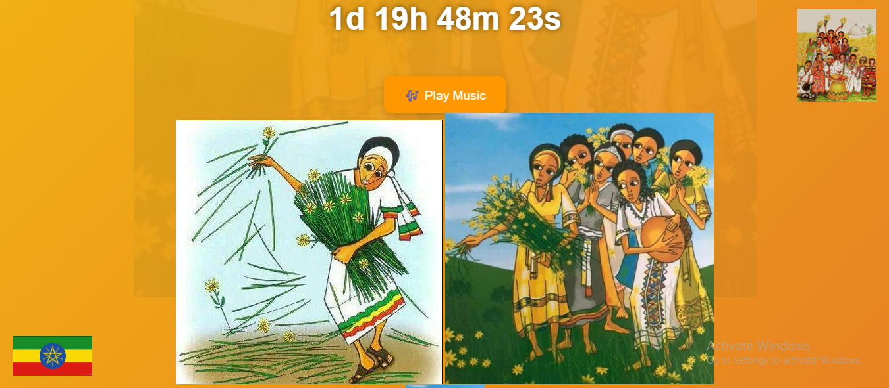

# 🎉 Day 55 – New Year Web Project 🎆

Ring in the New Year with this fun and interactive **\[NewYear]** built using **HTML, CSS, and JavaScript**!
This project is part of my **#100DaysOfCode challenge** and focuses on creating a clean, responsive, and modern web experience. 🖥️✨

---

## 🚀 Live Demo

🔗 [View Project on Netlify]([https://your-netlify-link.netlify.app](https://newyear-project.netlify.app/))

---

## 📸 Screenshot

---

## ✨ Features 🎊

* Interactive and responsive design across devices 📱💻
* Dynamic elements with JavaScript ⚡
* Fun and colorful UI to celebrate the New Year 🎇
* Input validation for smooth user experience ✅

---

## 🛠️ Built With 🏗️

* **HTML5**
* **CSS3** (Flexbox + Grid + Responsive design)
* **JavaScript (ES6)**

---

## 📚 Learning Goals 📖

This project helped me level up in:

* Creating responsive layouts with Flexbox and Grid 📐
* Handling user input and validation ✍️
* Applying CSS transformations, filters, and z-index 🎨
* Using Git & GitHub for version control 🐙

---

## 🎇 New Year Notes ✨

* Celebrating **Day 55** of my **#100DaysOfCode challenge**
* Reinforcing key web development concepts while having fun 🎉
* Planning to add more festive animations in upcoming days 🪄

---

## 👨‍💻 Author

Made with ❤️ and a dash of **New Year spirit** as part of my **#100DaysOfCode challenge – Day 54** 🎆

